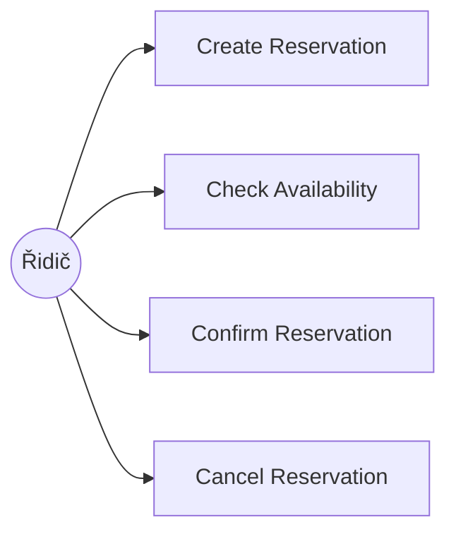
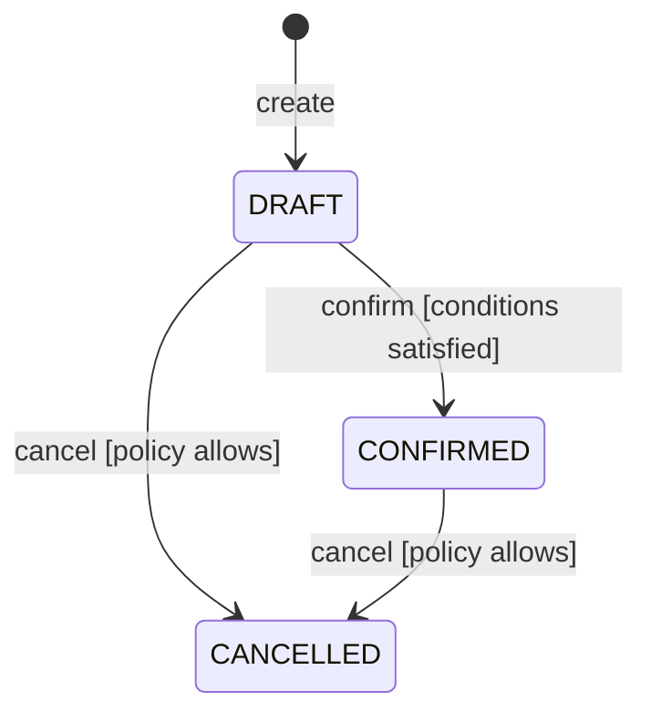
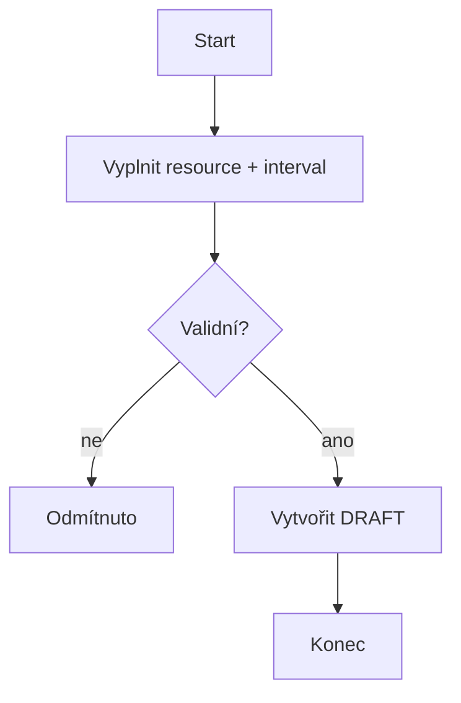

# Parking Reservation System — Specification

Stav: **DRAFT — čeká na schválení týmem jako Baseline v0.1** (sekce 10 kontroly konzistence níže).

Domain reference: [intent-and-change.md](intent-and-change.md) (Project Frame z C01).

---

## 0. Rozhodnutí přijatá před psaním operací

> Tyto body musí odsouhlasit celý tým — nejsou to implementační detaily, ale význam, na kterém stojí všechny čtyři operace. Pokud s něčím nesouhlasíte, přepište to zde, ne až v textu jednotlivé operace.

**Resource:** `ParkingSpot` je **exkluzivní** resource — v jednom okamžiku na něm může být nejvýše jedna `CONFIRMED` rezervace (ne kapacitní sdílení).

**Cancellation policy (návrh BR-03, potvrďte / upravte):**
`DRAFT` nebo `CONFIRMED` rezervaci lze zrušit kdykoliv před `Reservation.start` (porovnává se proti serverovému UTC času). Pokus o zrušení již `CANCELLED` rezervace je idempotentní úspěch (zůstává `CANCELLED`, žádná chyba). Pokud `start` nastal nebo uplynul, Cancel je odmítnut. Pokud se `Cancel` a `Confirm` potkají současně na téže rezervaci, vyhrává ten požadavek, který se zapíše do databáze jako první (řeší se transakcí/optimistickým zámkem v architektuře C03 — zde jen definujeme pozorovatelný výsledek: nejvýše jeden z nich uspěje).

**Časová osa:** veškeré časy (`start`, `end`, `currentTime`) jsou UTC (navazuje na ADR-003 z C01).

---

## 1. Doménová pravidla a invarianty (BR)

> Definováno jednou, operace na tato pravidla jen odkazují.

### BR-01 — Interval semantics
Reservation intervals use `[start,end)` semantics (konec intervalu je exkluzivní).

### BR-02 — Exclusive Resource invariant
At no committed system state may two `CONFIRMED` Reservations overlap for the same `ParkingSpot`.

### BR-03 — Cancellation policy
Viz „Rozhodnutí přijatá před psaním operací" výše — přepsat sem finální znění, jakmile ho tým odsouhlasí.

### BR-04 — Domain-specific rule from C01
Rezervaci `ParkingSpot` typu `EV_CHARGING` nebo `DISABLED` smí vytvořit pouze uživatel, jehož vozidlo/oprávnění odpovídajícímu typu skutečně odpovídá (elektromobil, ZTP průkaz) — ověřuje se při `Create Reservation`. (Převzato z [intent-and-change.md](intent-and-change.md).)

---

## 2. Operace

### OP-01 — Create Reservation

```
Goal / user value:

Trigger:

Observable requirement:
REQ-01:

Preconditions:
-

Success postcondition:
-

State change:
[none] → DRAFT

Referenced rules:
BR-01, BR-04

Main success scenario:
1.
2.
3.

Alternative / failure outcomes:
-

Verification examples:
-

Rationale:

Assumption / unknown / TBD:
```

### OP-02 — Check Availability

```
Goal / user value:

Observable requirement:
REQ-02:

Preconditions:
-

Success postcondition:
-

Referenced rules:
BR-01, BR-02

Verification examples:
-

Accepted semantics:
Intervals are half-open: [start,end).

Assumption / unknown / TBD:
```

### OP-03 — Confirm Reservation

```
Goal / user value:

Trigger:

Observable requirements:
REQ-03:
REQ-04 (concurrency):

Preconditions:
-

Success postcondition:
-

Failure outcomes:
-

Verification examples:
-

Assumption / unknown / TBD:
```

### OP-04 — Cancel Reservation

```
Goal / user value:

Observable requirement:
REQ-05:

Preconditions:
-

Success postcondition:
-

Failure outcomes:
-

Verification examples:
-

Assumption / unknown / TBD:
```

---

## 3. Diagramy

### 3a. Use case diagram (aktéři a cíle)



### 3b. Stavový diagram Reservation



### 3c. Diagram aktivit



---

## 4. Kontrola konzistence (bod 10 ze zadání)

| Kontrola | Stav | Poznámka |
|---|---|---|
| Create vs. Confirm | ☐ | |
| Availability vs. Confirm | ☐ | |
| Cancel vs. stavový diagram | ☐ | |
| Význam intervalů napříč operacemi | ☐ | |
| Use-case diagram vs. text | ☐ | |
| Požadavek vs. návrhové rozhodnutí | ☐ | |
| Nejistota vs. vymyšlená přesnost | ☐ | |

**Schváleno jako Specification Baseline v0.1:** ☐ ano / datum: _____ / kým: _____

---

## 5. Část B — Změna: schvalovací proces

### Analýza dopadu (bod 12)

| Oblast | Odpověď |
|---|---|
| Create | |
| Availability | |
| Confirm | |
| Approve | |
| Cancel | |
| Stavový diagram | |
| Diagram případů užití | |
| Ověření | |
| Architektura | |

### Dopad změny C02 (bod 13)

```
Změněná podmínka:
Dotčené požadavky / části specifikace:
Nedotčené požadavky / části + proč:
Nový aktér / operace, pokud vznikne:
Změněná pravidla / význam stavů:
Změna diagramu případů užití:
Změna stavového diagramu:
Nové příklady ověření:
Architektonické drivery pro C03:
```

### OP-05 — Approve Reservation *(jen pokud změna operaci skutečně vyžaduje)*

```
Goal / user value:

Trigger:

Observable requirement:
REQ-06:

Preconditions:
-

Success postcondition:
-

Failure outcomes:
-

Verification examples:
-

Assumption / unknown / TBD:
```

**Schváleno jako Specification Baseline v0.2:** ☐ ano / datum: _____ / kým: _____
