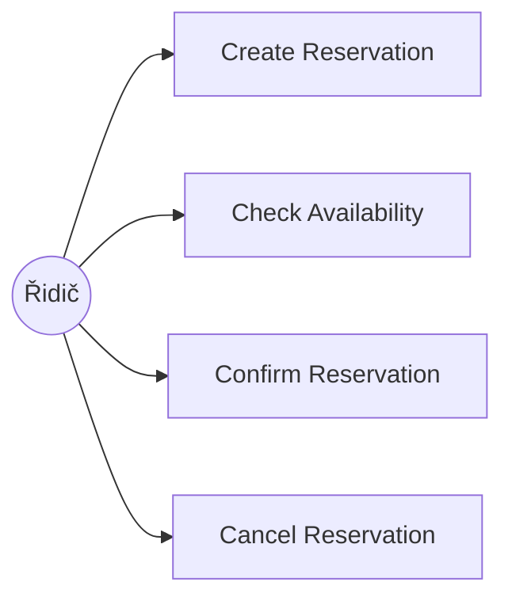
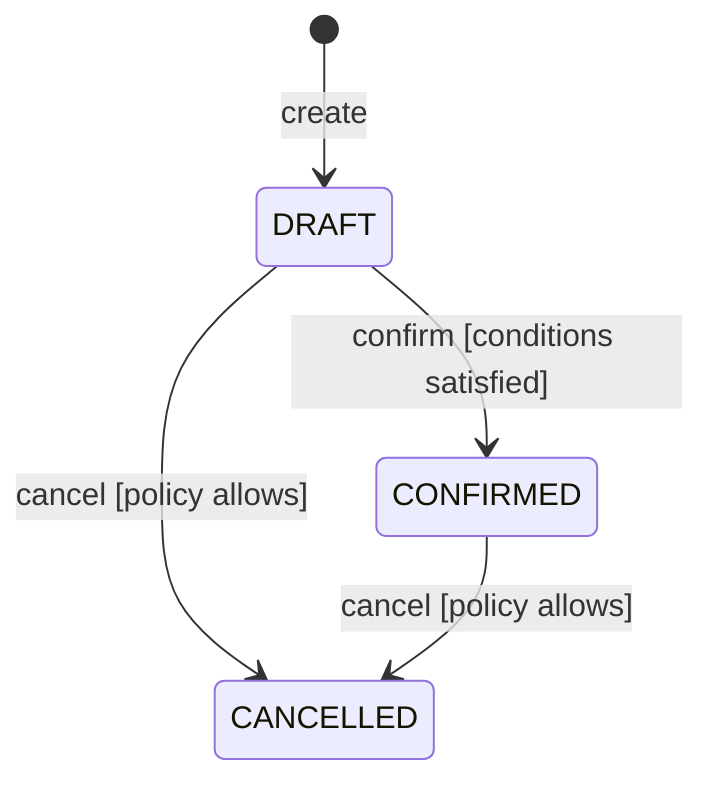
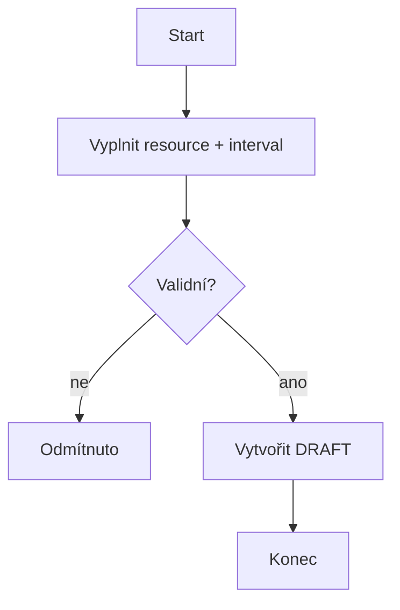

# Parking Reservation System — Specification

Stav: **DRAFT — čeká na schválení týmem jako Baseline v0.1** (sekce 10 kontroly konzistence níže).

Domain reference: [intent-and-change.md](intent-and-change.md) (Project Frame z C01).

---

## 0. Rozhodnutí přijatá před psaním operací

> Odsouhlaseno týmem (2026-10-02).

**Resource:** `ParkingSpot` je **exkluzivní** resource — v jednom okamžiku na něm může být nejvýše jedna `CONFIRMED` rezervace (ne kapacitní sdílení).

**Cancellation policy (BR-03):**
`DRAFT` nebo `CONFIRMED` rezervaci lze zrušit kdykoliv před `Reservation.start` (porovnává se proti serverovému UTC času). Pokus o zrušení již `CANCELLED` rezervace je idempotentní úspěch (zůstává `CANCELLED`, žádná chyba). Pokud `start` nastal nebo uplynul, Cancel je odmítnut. Pokud se `Cancel` a `Confirm` potkají současně na téže rezervaci, vyhrává ten požadavek, který se zapíše do databáze jako první (řeší se transakcí/optimistickým zámkem v architektuře C03 — zde jen definujeme pozorovatelný výsledek: nejvýše jeden z nich uspěje).

**Časová osa:** veškeré časy (`start`, `end`, `currentTime`) jsou UTC (navazuje na ADR-003 z C01).

---

## 1. Doménová pravidla a invarianty (BR)

> Definováno jednou, operace na tato pravidla jen odkazují.

### BR-01 — Interval semantics
Reservation intervals use `[start,end)` semantics (konec intervalu je exkluzivní).

### BR-02 — Exclusive Resource invariant
At no committed system state may two `CONFIRMED` Reservations overlap for the same `ParkingSpot`.

### BR-03 — Cancellation policy
A `DRAFT` or `CONFIRMED` Reservation may be cancelled any time before `Reservation.start` (server UTC time). Cancelling an already `CANCELLED` Reservation is an idempotent success. A Reservation whose `start` has been reached or passed cannot be cancelled. If `Cancel` and `Confirm` race on the same Reservation, at most one of them succeeds (whichever is persisted first).

### BR-04 — Domain-specific rule from C01
Rezervaci `ParkingSpot` typu `EV_CHARGING` nebo `DISABLED` smí vytvořit pouze uživatel, jehož vozidlo/oprávnění odpovídajícímu typu skutečně odpovídá (elektromobil, ZTP průkaz) — ověřuje se při `Create Reservation`. (Převzato z [intent-and-change.md](intent-and-change.md).)

---

## 2. Operace

### OP-01 — Create Reservation

```
Goal / user value:
Driver creates a reservation request for a ParkingSpot that can later
be confirmed.

Trigger:
Authorized User (driver) requests a Reservation for ParkingSpot S and
interval I.

Observable requirement:
REQ-01:
The system shall create a DRAFT Reservation for an existing ParkingSpot
when the requested interval is valid and, if the spot type requires it
(EV_CHARGING or DISABLED), the requesting user/vehicle satisfies BR-04.

Preconditions:
- User is authorized to create Reservations.
- ParkingSpot exists.
- start < end (BR-01).
- If ParkingSpot.Type is EV_CHARGING or DISABLED, the user/vehicle
  satisfies BR-04.

Success postcondition:
- one new Reservation exists;
- Reservation.state = DRAFT;
- no ParkingSpot allocation is committed yet (BR-02 only constrains
  CONFIRMED reservations).

State change:
[none] → DRAFT

Referenced rules:
BR-01, BR-04

Main success scenario:
1. User submits ParkingSpot id, interval, and (if relevant) vehicle info.
2. System validates authorization, ParkingSpot existence, interval
   validity and BR-04 eligibility.
3. System creates Reservation in DRAFT.
4. System returns the Reservation identifier and current state.

Alternative / failure outcomes:
- unauthorized User → reject; no Reservation created;
- unknown ParkingSpot → reject; no Reservation created;
- invalid interval (start >= end) → reject; no Reservation created;
- EV_CHARGING/DISABLED spot requested without matching vehicle/permit
  → reject (BR-04); no Reservation created.

Verification examples:
valid STANDARD ParkingSpot + [10:00,11:00) → one DRAFT created
start == end → rejected
unknown ParkingSpot id → rejected
EV_CHARGING spot + non-electric vehicle → rejected

Rationale:
Creation records driver intent without committing spot allocation;
BR-04 eligibility depends on static vehicle/user attributes, not on
concurrent reservations, so it is checked here rather than at Confirm.

Assumption / unknown / TBD:
TBD — zdroj informace "vozidlo je elektromobil / má ZTP" (součást
požadavku na vytvoření, nebo profil uživatele?) zatím není určen.
```

### OP-02 — Check Availability

```
Goal / user value:
User can determine whether a ParkingSpot is available for a requested
interval before attempting to reserve it.

Observable requirement:
REQ-02:
For a valid interval, the system shall report a ParkingSpot as
unavailable if the interval overlaps any CONFIRMED Reservation of that
ParkingSpot; otherwise it shall report it as available.

Preconditions:
- ParkingSpot exists.
- requested interval is valid (BR-01).

Success postcondition:
- availability result is returned;
- no Reservation state is changed.

Referenced rules:
BR-01, BR-02

Verification examples:
Existing CONFIRMED: [10:00,11:00)

query [09:00,10:00) → AVAILABLE
query [10:30,11:30) → UNAVAILABLE
query [11:00,12:00) → AVAILABLE

Accepted semantics:
Intervals are half-open: [start,end).

Assumption / unknown / TBD:
DRAFT reservations do not block availability — only CONFIRMED ones do
(plyne z BR-02 a z toho, že OP-01 ještě neallokuje spot).
```

### OP-03 — Confirm Reservation

> **TODO (Marek):** doplnit podle vzoru v zadání C02 (sekce 6), adaptovat na ParkingSpot/BR-02.

```
Goal / user value:

Trigger:

Observable requirements:
REQ-03:
REQ-04 (concurrency):

Preconditions:
-

Success postcondition:
-

Failure outcomes:
-

Verification examples:
-

Assumption / unknown / TBD:
```

### OP-04 — Cancel Reservation

> **TODO (Robin):** doplnit podle vzoru v zadání C02 (sekce 7) a podle odsouhlasené politiky BR-03 výše.

```
Goal / user value:

Observable requirement:
REQ-05:

Preconditions:
-

Success postcondition:
-

Failure outcomes:
-

Verification examples:
-

Assumption / unknown / TBD:
```

---

## 3. Diagramy

### 3a. Use case diagram (aktéři a cíle)

> **TODO (Robin):** zkontrolovat/doplnit podle finálních operací.



### 3b. Stavový diagram Reservation

> **TODO (Marek):** zkontrolovat/doplnit podmínky přechodů podle OP-03 textu.



### 3c. Diagram aktivit

> **TODO (Robin):** doplnit diagram aktivit pro Confirm a/nebo Cancel (tenhle je jen pro Create jako ukázka).



---

## 4. Kontrola konzistence (bod 10 ze zadání)

| Kontrola | Stav | Poznámka |
|---|---|---|
| Create vs. Confirm | ☐ | |
| Availability vs. Confirm | ☐ | |
| Cancel vs. stavový diagram | ☐ | |
| Význam intervalů napříč operacemi | ☐ | |
| Use-case diagram vs. text | ☐ | |
| Požadavek vs. návrhové rozhodnutí | ☐ | |
| Nejistota vs. vymyšlená přesnost | ☐ | |

**Schváleno jako Specification Baseline v0.1:** ☐ ano / datum: _____ / kým: _____

---

## 5. Část B — Změna: schvalovací proces

### Analýza dopadu (bod 12)

| Oblast | Odpověď |
|---|---|
| Create | |
| Availability | |
| Confirm | |
| Approve | |
| Cancel | |
| Stavový diagram | |
| Diagram případů užití | |
| Ověření | |
| Architektura | |

### Dopad změny C02 (bod 13)

```
Změněná podmínka:
Dotčené požadavky / části specifikace:
Nedotčené požadavky / části + proč:
Nový aktér / operace, pokud vznikne:
Změněná pravidla / význam stavů:
Změna diagramu případů užití:
Změna stavového diagramu:
Nové příklady ověření:
Architektonické drivery pro C03:
```

### OP-05 — Approve Reservation *(jen pokud změna operaci skutečně vyžaduje)*

```
Goal / user value:

Trigger:

Observable requirement:
REQ-06:

Preconditions:
-

Success postcondition:
-

Failure outcomes:
-

Verification examples:
-

Assumption / unknown / TBD:
```

**Schváleno jako Specification Baseline v0.2:** ☐ ano / datum: _____ / kým: _____
